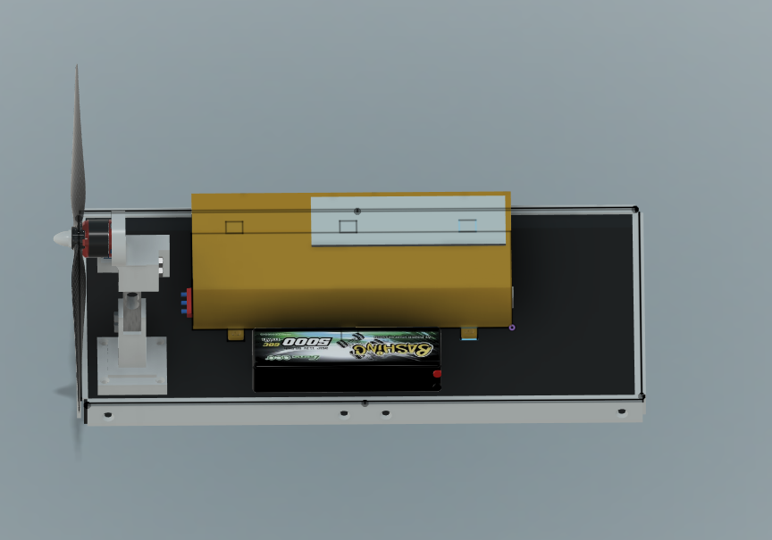

# Project: Motor Performance Analysis with Different Propellers and Batteries

## Overview

This project focuses on evaluating the performance of a motor (dji 2212/920 kV) under varying conditions by measuring thrust, RPM, voltage, and current. The tests were conducted using two types of propellers—plastic and carbon—and two types of batteries: 3S1P and 4S1P.

## Initial Setup

### 3D model

## Tests Conducted

### Test 1: Plastic Propeller with 3S1P Battery

### Results
- **Voltage (V):**
  
- **Current (A):**
  
- **Speed (RPM):**
  
- **Motor Speed (%):**
  
- **Thrust (g):**
  

### Test 2: Carbon Propeller with 3S1P Battery

### Results
- **Voltage (V):**
  
- **Current (A):**
  
- **Speed (RPM):**
  
- **Motor Speed (%):**
  
- **Thrust (g):**
  

### Test 3: Plastic Propeller with 4S1P Battery

### Results
- **Voltage (V):**
  
- **Current (A):**
  
- **Speed (RPM):**
  
- **Motor Speed (%):**
  
- **Thrust (g):**
  

### Test 4: Carbon Propeller with 4S1P Battery

### Results
- **Voltage (V):**
  
- **Current (A):**
  
- **Speed (RPM):**
  
- **Motor Speed (%):**
  
- **Thrust (g):**
  

## Conclusion

The results show significant differences in performance based on the combination of propeller material and battery type. These insights are valuable for optimizing motor setups in RC models or drones.

